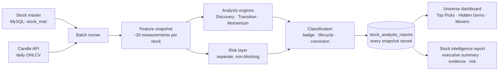
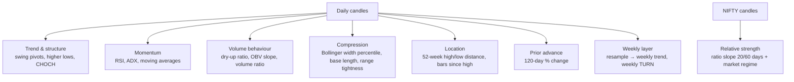
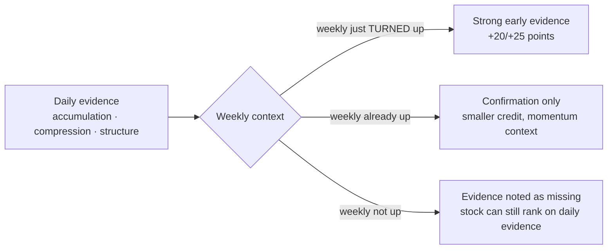
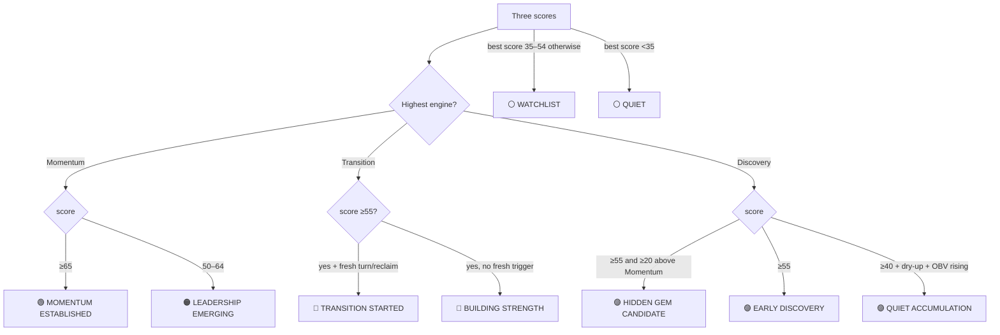
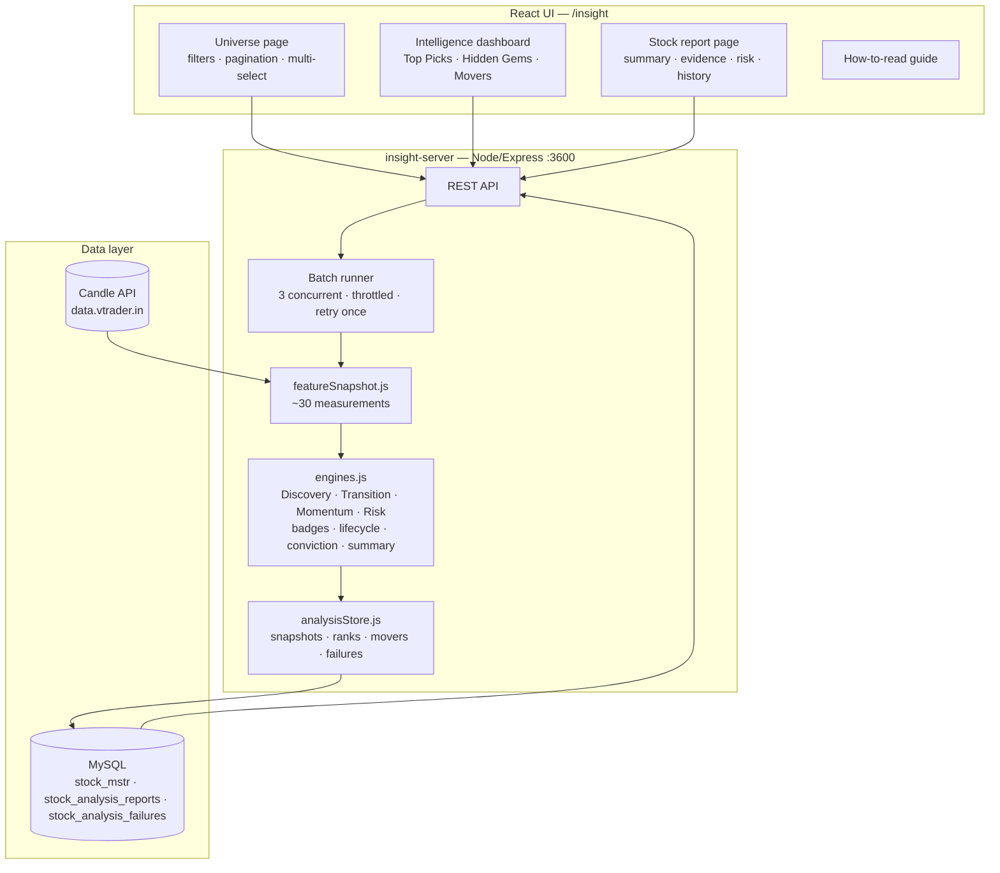
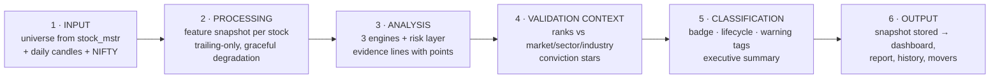

# Stock Insight — System Design & Methodology

> **Version** engine `v2-2026.07` weights · presentation `v3` · **Status** Production
> **Audience** anyone with basic stock-market knowledge
> **Honesty note** This document describes only what the system actually does. Anything commonly found in trading tools but *not* used here (intraday timeframes, candlestick patterns, buy/sell signals, targets, stop losses) is explicitly called out as **not used** — usually because our own research showed it added no value, or because the product deliberately refuses to give trading advice.

---

## 1. System Overview

### 1.1 What Stock Insight is

Stock Insight is a **market research intelligence platform**. It scans the entire stock universe every time an analysis runs and answers one question per stock:

> **"Does this stock deserve investigation, because it may be *early* in a big move?"**

It is built to find **hidden gems** — stocks being quietly accumulated *before* the crowd notices — and to clearly separate them from stocks the market has already discovered.

> ⚠️ **What Stock Insight is NOT**
> It is not a tip service and not a trading system. It produces **no buy/sell/hold signals, no entry prices, no stop losses, no targets**. It ranks stocks by research interest and explains its evidence. Every decision — and all homework on the company's business, results and news — belongs to the user.

### 1.2 Design principles

| Principle | What it means in practice |
|---|---|
| **Evidence, not opinion** | Every score comes from rules whose predictive value was measured on 2020–2026 history (25,000+ observations, walk-forward validated). Rules that failed testing were removed, even popular ones. |
| **Explainability** | Every point of every score maps to a visible, human-readable evidence line. No black boxes. |
| **Early over obvious** | The system is optimised to flag stocks *before* recognition, accepting a lower hit rate in exchange for earliness. |
| **Risk is shown, never hidden — and never a veto** | Research showed many past big winners were small, volatile and illiquid. A "safety filter" would delete exactly the stocks the product exists to find. So risk is displayed prominently but never silently removes a stock. |
| **Honest uncertainty** | Every report carries the real historical hit rate (~1 in 3 top candidates worked) so nobody mistakes ranking for prediction. |

### 1.3 End-to-end pipeline at a glance

---

## 2. Stock Analysis Methodology

### 2.1 Data collected

| Data | Source | Depth | Used for |
|---|---|---|---|
| Daily OHLCV candles per stock | Candle API (`/data/candle`, frequency `D`) | From 2022 (~900 trading days) | All signal computation |
| Daily NIFTY candles | Same API | Same | Relative strength, market regime |
| Stock metadata (name, sector, industry, active flag) | MySQL `stock_mstr` | — | Universe, filters, sector ranking |
| Weekly candles | **Derived** — resampled locally from daily | — | Weekly trend & weekly turn |

That is the complete input. **Not used:** fundamentals, news, social sentiment, options data, intraday candles. Fundamentals and news are simply not wired in (the platform says "not evaluated" rather than guessing); intraday was tested and dropped (see §3).

### 2.2 Processing — the feature snapshot

For each stock, the latest ~900 daily candles are reduced to a single **feature snapshot**: about 30 measurements describing the stock's current condition. Every measurement uses only past data (no look-ahead), and every long-horizon measurement degrades gracefully — if a stock has only 60 days of history, features needing more are marked *unavailable* rather than faked.

### 2.3 Filtering

Filtering is minimal by design (aggressive filters delete hidden gems):

1. **Active stocks only** (`is_active = 1` in the master table).
2. **≥ 30 daily bars** — the mathematical minimum for the short-term indicators. Below that, the stock is recorded as a *failure with reason* (visible in the UI), not silently skipped.
3. That's all. No market-cap floor, no liquidity floor at analysis time — liquidity becomes a **risk flag**, not an exclusion.

### 2.4 Signal generation

Signals are boolean **evidence checks** against fixed thresholds (full catalogue in §4–§5). Each check that passes produces an *evidence line* with: a plain-language label, an explanation, and a fixed point value derived from its measured historical predictive lift. Each check that fails lands in the *missing evidence* list — equally visible, because knowing what's absent is half the analysis.

### 2.5 Scoring — three engines plus risk

Three engines score every stock **independently** (0–100 each). They deliberately answer different questions and are never merged into a single number:

| Engine | Question | Character |
|---|---|---|
| 🟣 **Discovery** | "Could this be early?" | The flagship. Rewards quiet pre-move evidence. |
| 🔵 **Transition** | "Is it waking up right now?" | Rewards the *moment of change*. |
| 🟢 **Momentum** | "Is it already recognised?" | Rewards established strength; honestly labelled *later-stage*. |
| ⚠️ **Risk** | "What can go wrong?" | Separate layer; informs, never vetoes. |

### 2.6 Confidence — conviction and market context

A raw score means little without context, so the system adds:

* **Rank & percentile** — each engine score is ranked against every analysed stock (market-wide, within sector, within industry). "Discovery 62" becomes "Discovery 62 · #5 of 1,200 · Top 0.4%".
* **Conviction (1–5 ★)** — one combined confidence rating: `0.45 × best engine score + 0.35 × market percentile + 0.20 × (100 − risk score)`, mapped to stars (≥78→5★, ≥64→4★, ≥50→3★, ≥36→2★, else 1★).

### 2.7 Final output

The final product of an analysis is **not a recommendation**. It is:

1. A **badge** (classification) — e.g. *HIDDEN GEM CANDIDATE* (§6.2).
2. A **lifecycle position** — Discovery → Transition → Momentum, answering "how early are we?".
3. An **executive summary** — a five-sentence analyst note generated from the evidence.
4. The full **evidence and risk breakdown**, ranks, conviction, and score history.

Everything is stored as a snapshot in MySQL, so score trends and badge upgrades/downgrades are tracked over time.

---

## 3. Timeframes

### 3.1 What is used

| Timeframe | Role | Why |
|---|---|---|
| **Daily** | **Computation core.** All indicators, structure, volume and location features. | Deep, reliable history; matches the product's holding-period horizon (weeks–months). |
| **Weekly** (derived from daily) | **Regime lens.** Weekly trend state and — critically — the weekly **turn**. | The weekly trend was the single strongest validated predictor across every test we ran; its fresh *turn* is early information while its established state is confirmation. |
| **Implicit long windows** | 120-day prior advance, 250-day (52-week) location, 200-day average. | These give monthly-scale context without a separate monthly series. |

### 3.2 What is deliberately NOT used — and why

**Intraday timeframes (1m, 5m, 15m, 1H, 4H) are not used.** An earlier version of the engine did analyse 15m/30m/1H/4H and scored "multi-timeframe alignment". It was removed after research for two reasons: intraday history isn't deep enough to validate over the 2020–2026 window, and the daily+weekly version of the alignment signal showed **no measurable predictive value** for the product's horizon. Stock Insight answers *"is this stock preparing a multi-week/multi-month move?"* — a question intraday data cannot improve.

### 3.3 How daily and weekly combine

There is no complicated "alignment matrix". The combination is simple and validated:

One validated interaction deserves emphasis: **compression only earns points when combined with a prior advance** — a daily squeeze inside a stock that already demonstrated strength tested at 1.3× the base rate; the identical squeeze without prior strength tested *below* base rate and scores nothing.

---

## 4. Indicators

Every indicator in production, its exact configuration, and how it contributes. (Indicators not listed — MACD, Ichimoku, Stochastic, Fibonacci, VWAP, etc. — are **not used**: they either failed validation or were never needed.)

| Indicator | Settings | Purpose | Bullish reading | Bearish / caution reading |
|---|---|---|---|---|
| **RSI** (Relative Strength Index) | 14-day, Wilder | Momentum thermometer | 45–65 mid-zone = healthy trend (+10 in Momentum); recovery from <35 to >50 tracked as a reversal hint | RSI alone never penalises — research showed "overbought" stocks kept rising more often than they reversed |
| **ATR** (Average True Range) | 14-day, Wilder, shown as % of price | Volatility measurement | — (not an opportunity signal) | >4% of price = HIGH VOLATILITY risk flag; >2.5% = elevated |
| **EMA 20 / EMA 50** | Daily closes | Short/medium trend posture | Price above = supportive context | Price below = weak posture |
| **SMA 200** | Daily closes | The long-term health line | Above = long-term uptrend territory (+6 context); **reclaiming it after time below = strongest validated recovery signal (+30 in Transition, 1.38× lift)** | Below = long-term damage not yet repaired |
| **Bollinger Bands → width percentile** | 20-day, 2σ; width ranked against trailing 120 days | Volatility compression ("squeeze") detection | Width in the tightest 30% + a base ≥10 bars + **a prior advance** = quality compression (+15 in Discovery) | A squeeze **without** prior strength means nothing (tested 0.95× — below base rate) |
| **OBV** (On-Balance Volume) + 20-day slope | Cumulative volume ± by up/down day | Accumulation footprint | Rising OBV while price is flat = someone is quietly buying (+10) | Falling OBV with high volume = DISTRIBUTION RISK flag |
| **Volume averages** | 10-day vs 50-day ratio ("dry-up"); latest vs 20-day ("volume ratio"); 5-day vs 20-day (acceleration) | Supply/demand behaviour | 10d < 75% of 50d = volume dry-up, supply exhausted (+15/+6/+10 across engines — positive in *every* model tested) | High volume with falling OBV = selling into strength |
| **ADX** | 14-day, Wilder | Trend-energy gauge | **Low** ADX (<20) in an established uptrend = quiet pullback, resting not distributing (+15 in Momentum, 1.10×) | — |
| **Weekly EMA 20** | On weekly closes (resampled) | Weekly trend definition | Close above a rising 20-week EMA = weekly uptrend; the fresh **turn** into this state = +20/+25 (1.25× validated in early-stage stocks) | Weekly down while price sits near its highs = validated trap (7.5% historical win rate) |

> 💡 **Reading the points** Point values are frozen from research and only change through a re-run of the validation protocol. Bigger points = historically more predictive, not "more popular".

---

## 5. Price Action Concepts

Concepts actually used in production. (Not used, per the honesty rule: candlestick patterns, classical chart patterns (head-and-shoulders, flags…), liquidity sweeps, order blocks, fair-value gaps. CHOCH is the one SMC-adjacent concept that survived testing, and only in its specific validated context.)

### 5.1 Market structure

Swing highs and lows are detected as **pivots** (a bar whose high/low exceeds 3 bars on each side, confirmed only 3 bars later — no repainting). From the pivot sequence the system derives:

* **Trend** — higher highs + higher lows = UPTREND; lower highs + lower lows = DOWNTREND; otherwise RANGE.
* **Higher low** — the most recent confirmed low sits above the previous one → sellers weakening (+10 in Transition).
* **Change of character (CHOCH)** — in a downtrend, price closes above the last lower high for the first time → the downtrend's rhythm is broken (+10 in Transition). Kept deliberately small: testing showed it fires early but with many false positives.

### 5.2 Prior advance (stage analysis)

The single most predictive concept in the whole system: **has this stock already risen ≥30% over the past ~6 months (120 trading days)?** Strength that then *rests* tends to continue (1.28× lift; every combination we tested *without* it fell below the base rate). This encodes the classic stage-analysis idea that leaders reveal themselves before their biggest legs.

### 5.3 Bases, compression and volatility contraction

A **base** = price holding within ±8% of its 20-day average for consecutive bars. **Compression** = Bollinger width in its tightest 30% of the last 120 days while a base ≥10 bars exists. Valid **only after a prior advance** (see §3.3) — the "coiled spring" is real, but only for springs that were already shown to be strong.

### 5.4 Volume analysis (supply & demand behaviour)

Three behaviours, in Wyckoff spirit but with tested thresholds: **dry-up** (10-day volume < 75% of 50-day → supply exhausted), **quiet accumulation** (OBV rising while price is calm), and **distribution warning** (high volume while OBV falls). Volume *expansion* as a bullish signal was tested and **removed** — it flagged moves that had already started.

### 5.5 Location: 52-week context

Distance from the 52-week high plays two validated roles: **≥15% below the high = "under-followed territory"** (+10 in Discovery — future big winners sat *deeper* below their highs than average stocks months before their moves), and **near the high with a weekly downtrend = trap** (7.5% historical win rate → warning, no points).

### 5.6 Support & resistance zones

Computed by clustering swing pivots (touched ≥2 times, within 0.75×ATR) — **used only to annotate the weekly chart** as key supply/demand zones for visual context. They carry zero points in any score, because the product gives no entries or exits.

### 5.7 Market regime

Whether NIFTY trades above its own 200-day average. Displayed as a risk-context factor ("index-level headwind"). Deliberately **not** a scoring input: the fitted regime weight in research was an artifact of 2020-23 buy-the-dip and was rejected.

---

## 6. Decision Logic

### 6.1 How evidence combines — exact point tables

Scores are simple additive sums, capped at 100. No hidden weights, no netting between engines.

**🟣 Discovery** — "Could this be early?"

| Evidence | Points |
|---|---|
| Prior advance ≥30% / 120 days | +30 |
| Weekly trend just turned up | +20 |
| Compression (BB ≤30th pct + base ≥10 bars) **and** prior advance | +15 |
| Volume dry-up (10d < 75% of 50d) | +15 |
| OBV rising (20-day slope > 0) | +10 |
| ≥15% below 52-week high | +10 |

**🔵 Transition** — "Is it waking up?"

| Evidence | Points |
|---|---|
| 200-day SMA reclaimed (above now, below ~20 days ago) | +30 |
| Weekly trend just turned up | +25 |
| Weekly trend up (established state) | +12 |
| Volume dry-up | +15 |
| Higher low formed | +10 |
| OBV rising | +10 |
| Change of character | +10 |
| Relative strength vs NIFTY improving | +5 |

**🟢 Momentum** — "Already recognised?" *(gate: only scores stocks in a weekly uptrend AND above the 200-SMA; otherwise 0)*

| Evidence | Points |
|---|---|
| Established trend (the gate itself) | +30 |
| Prior advance ≥30% | +20 |
| Quiet pullback (ADX < 20) | +15 |
| Volume dry-up in rest | +10 |
| Strongly extended (>80% off 52w low, RSI > 72) | +10 |
| RSI 45–65 mid-zone | +10 |

**⚠️ Risk** *(separate; starts at 20, higher = riskier; LOW <35, MEDIUM 35–59, HIGH ≥60)*

| Factor | Points | Also raises tag |
|---|---|---|
| ATR > 4% of price (>2.5% half credit) | +20 / +10 | HIGH VOLATILITY |
| Avg daily turnover < ₹2cr (<₹5cr half) | +20 / +10 | THIN LIQUIDITY |
| >40% below 52-week high | +15 | — |
| Downtrend with no higher low | +15 | WEAK STRUCTURE |
| Volume quiet but OBV falling | +10 | — |
| NIFTY below its 200-day average | +10 | — |
| Limited price history (<260 bars) | +10 | — |

### 6.2 Classification (badges) — exact rules

There is **no Buy/Sell/Hold** — the "decision" is a classification. The engine family with the highest score decides the badge family; thresholds decide the badge:

### 6.3 Priorities and conflicts

* **The hidden-gem gap rule** (the product's core statement): if Discovery ≥ 50 and exceeds Momentum by ≥20 points, the report says explicitly *"the market has NOT yet recognised this stock."* The reverse gap produces *"already recognised — later-stage opportunity."*
* **Conflicting evidence is not netted.** A stock can be Discovery 85 / Momentum 20 / Risk HIGH simultaneously — all three are shown. Warning tags (⚠ DISTRIBUTION RISK, WEAK STRUCTURE, THIN LIQUIDITY, HIGH VOLATILITY) coexist with any opportunity badge.
* **Risk never vetoes.** Validated decision: no risk condition appeared ≥1.5× more often in failures than successes, so filters would only remove winners.

---

## 7. Architecture

**Key storage design:** every analysis is an immutable snapshot row (`is_latest` flag marks the current one). This gives instant universe reads, full score history per stock, badge upgrade/downgrade detection, and a dataset for future performance studies. Failures are stored with per-symbol reasons. Analysis runs as a background job with live progress; single-stock refresh is synchronous.

---

## 8. Workflow — end to end

Step details: **(1)** batch job queues all active stocks (or a user selection); one API call per stock. **(2)** stocks with <30 bars are recorded as explained failures; 30–259 bars are analysed with long-horizon features marked unavailable plus a "limited history" risk factor. **(3)** each engine emits evidence + missing lists. **(4)** the stock is ranked against all latest snapshots; conviction is computed. **(5)** badge rules (§6.2), lifecycle stage, and the summary generator run. **(6)** the snapshot is written; the dashboard's movement lists (improvers, new signals, upgrades/downgrades) compare it with the previous snapshot.

---

## 9. Worked Examples

### Example A — a Hidden Gem profile

Imagine **ABC-EQ**, a small industrial stock, on analysis day:

| Measurement | Value | Evidence triggered |
|---|---|---|
| 120-day change | **+47%** | ✓ Prior advance (+30 Discovery, +20 Momentum-if-gated) |
| Bollinger width percentile | **22nd** tightest, base = 34 bars | ✓ Quality compression, since prior advance exists (+15) |
| Volume 10d/50d | **0.62** | ✓ Volume dry-up (+15 Discovery, +15 Transition) |
| OBV 20-day slope | **positive** | ✓ Quiet accumulation (+10) |
| From 52-week high | **−24%** | ✓ Under-followed territory (+10) |
| Weekly trend | up, but turned **7 weeks ago** | not a fresh turn → no +20; weekly state helps Transition (+12) |
| 200-SMA | above, no recent reclaim | context only |
| ADX / RSI | 17 / 54 | quiet, balanced |
| ATR | 3.1% | ⚠ elevated volatility (risk +10) |
| Turnover | ₹3.4cr | ⚠ modest liquidity (risk +10) |

**Scores.** Discovery = 30 + 15 + 15 + 10 + 10 = **80**. Transition = 12 + 15 + 10 = **37**. Momentum passes its gate (weekly up + above 200-SMA), so: 30 (gate) + 20 (prior advance) + 15 (quiet pullback, ADX 17) + 10 (dry-up) + 10 (RSI mid-zone) = **85**.

**Classification.** The highest engine is Momentum (85), so the badge comes from the momentum family: **MOMENTUM ESTABLISHED** — and because Momentum ≥ Discovery, the summary honestly states the trend is already partly recognised. This example shows the system refusing to over-sell: strong Discovery evidence alone doesn't make a hidden gem if the market clearly already participates.

**The counterfactual that makes it a gem.** Same stock, but caught **before** its weekly trend established: Momentum gates to 0, Discovery 80 stands alone, the gap rule fires (80 − 0 ≥ 20) → badge **HIDDEN GEM CANDIDATE** with the note *"early evidence is much stronger than current momentum — the market has NOT yet recognised this stock."* Catching it in that earlier window is precisely what the platform is optimised for.

**Risk:** 20 + 10 (ATR) + 10 (liquidity) = 40 → **MEDIUM**. Conviction: best score 85 in, say, the top 2% of the market with medium risk → ≈ **4★ High**.

### Example B — a recovery just starting

**XYZ-EQ** fell 55% over 18 months, then: price crosses back above the 200-SMA this month (✓ reclaim +30), weekly EMA turns up (✓ fresh turn +25), volume dry-up (✓ +15), a higher low is confirmed (✓ +10). Discovery is modest (no prior advance — it's been falling) = ~25. Transition = 30+25+15+10 = **80** → badge **TRANSITION STARTED**, lifecycle highlights the middle stage, and the missing-evidence list tells the user exactly what hasn't happened yet (no prior advance, RS still weak). Risk shows the −55% drawdown factor honestly.

### Example C — nothing happening

**PQR-EQ**: no prior advance, wide Bollinger bands, normal volume, weekly down, 40% below highs with no higher low. All engines < 25 → badge **QUIET**, with WEAK STRUCTURE tag. The report exists, says so plainly, and wastes nobody's time.

---

## Appendix A — Research provenance (why these rules)

The rule set is the survivor of a four-phase research programme on 2020–2026 NSE history (119-stock validated sample, ~25,000 observations, labels from +10%/20 days to +100%/250 days):

* **Phase 1** — the original indicator-rich engine scored **AUC 0.502 on unseen data (coin flip)**; a fitted model found weekly trend dominant; volume expansion, CMF, BOS-points and the "overbought penalty" were flat or inverted → removed.
* **Phase 2** — multi-horizon validation: the surviving evidence beat base rates at every horizon and in 4/4 walk-forward folds; ranking simulations showed it is a **screener, not a top-5 autopilot**; big-winner capture 15–16% vs 10% random.
* **Phase 3** — architecture test: specialized engines beat one universal score in the reversal context (+10pp); coefficient sign-flips proved one score cannot serve momentum and reversal simultaneously → the three-engine design. Risk separation validated.
* **Phase 4** — timing validation: the Discovery prototype flagged 54% of future +50% movers at a **median lead of ~7 months**; prior advance proven the core driver (combos without it fell below base rate); no failure-based veto cleared the evidence bar → no hard filters.

**Known limitations, stated plainly:** absolute hit rates are inflated by survivorship bias (delisted losers absent from history); the validated hit rate is ~32% of top-decile Discovery names reaching +50% within ~6 months — **most candidates do not move**; sector relative strength is currently inactive (index symbol mapping pending); fundamentals and news are not evaluated. Weights change only through a re-run of the research protocol, never by hand.

---

*Stock Insight is a research and education tool. Nothing it produces is investment advice or a recommendation to buy or sell any security. Verify fundamentals and news independently and consult a registered investment adviser before making decisions.*
